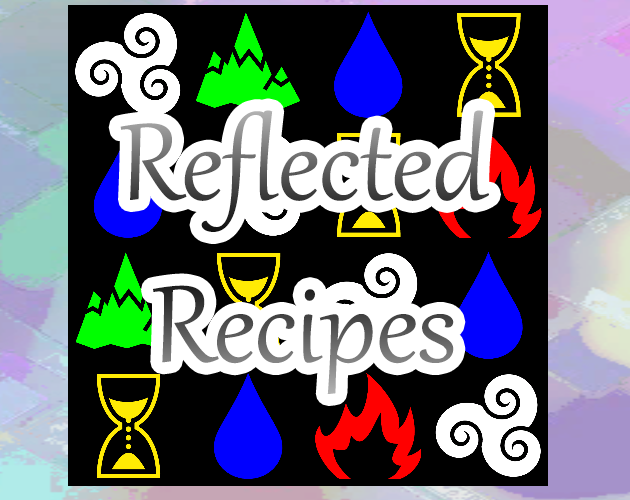

# Reflected Recipes

Made by Anopob and Neil for Global Game Jam (Game Dev London x Into Games) 2022, a 48 hour game jam with a theme of "duality".

Jam link: https://itch.io/jam/game-dev-london-x-into-games-ggj22

## Development

Requires TextMeshPro imports.

## Credits

### Art

**Icons** 
https://game-icons.net/
- One icon was modified by Neil

**Background image (original)** 
David Zydd (https://pixabay.com/illustrations/colorful-background-multicolored-2721468/)
- Modified by Anopob

### Music

**"Path to Lake Land"** 
Alexandr Zhelanov (https://soundcloud.com/alexandr-zhelanov)

### Sounds

**Button click and undo move sounds** 
p0ss (https://opengameart.org/content/interface-sounds-starter-pack)

**Valid move sound** 
NenadSimic (https://opengameart.org/content/menu-selection-click)

**Invalid move sound** 
dklon (https://opengameart.org/content/gonk-gong)
